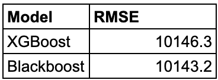
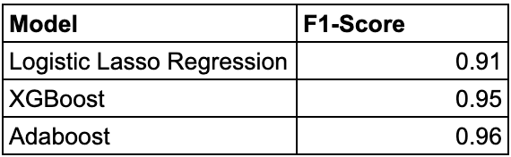

# Credit Risk Analysis

## Problem Description

In this project, I quantify the credit risk of individuals who apply for a loan at a bank. Specifically, I decide (1) which applicants to give loan to based on their characteristics, and (2) determine the loan amount given to each applicant. 

The objective is to maximize the bank’s profits obtained from these loans.

The task is to classify loan applications into default or non-default (binary classification task), then predict the loan amount for those predicted as non-default (regression task).

## Data

I apply methods to an **imbalanced dataset** with a size of 1 million rows and 32 columns. Out of 1,000,000 loan applications, only 50,000 (5%) of them defaults. The dataset includes features about the customers and information about their default status as well as the magnitude of profit or loss incurred for each loan.

The dataset can be accessed by this link: https://drive.google.com/file/d/102q3Ki7qN0pAW2i-WJsOYP1dhO9VEIaW/view?usp=share_link

## Methodology

### Data Pre-processing

Some of the data pre-processing include:
- eliminating redundant features,
- filling missing values,
- identifying outliers,
- checking correlation and multicollinearity among variables, and
- applying undersampling with SMOTE to handle class imbalance.

### Model Design

I develop a two-stage framework for the task. First, I build a binary classification model to estimate the probability of default for each individual. if the probability is greater than cutoff value, the loan amount will be greater than zero. Otherwise, the loan amount will be zero. 

Then, I build a regression model to predict the loan amount for each individual who are predicted to be non-defaulters. If the predicted loan amount is lower than the requested loan amount, then I give the predicted loan amount. If the predicted loan amount is higher than the requested loan amount, then I give the requested loan amount. The advantage of this method is that it is intuitive and easy to interpret.

## Models

### Classification
1. Logistic Regression (Baseline)
2. XGBoost (one of the most popular ML algorithms and is known to yield highly accurate results.)
3. Adaboost (usually a good classification method in cases with imbalanced data.)

As the evaluation metric, I use the F1 score, which is known to provide robust results for imbalanced datasets. 

Logistic regression is the baseline because it is a simpler algorithm and does not require much time to build compared to other models. Within the logistic regression, I apply variable selection using Lasso (L-1) regularization.

### Regression
1. XGBoost
2. Blackboost (a gradient boosting method where regression trees are utilized as base-learners.)

As the evaluation metric, I use the RMSE.

## Results

### Identifying Important Features: Variable Importance

Variable importance graph shows that some of the most important variables are:

- Total used amount of revolving credit (MNT_UTIL_REN),
- Value of financial assets (MNT_ACT),
- Number of transactions refused due to insufficient funds in the last 12 months (NB_ER_12MS), etc.

The results make sense; clients with low financial liabilities or a very hih amount of revolving credit (i.e., high credit utilization) tend to have a higher risk of default, while the number of transactions refused due to insufficient funds in the last 12 months give an accurate indication as to whether the client can payback their debt by their savings or assets.

### Model Performances

For the classification task, I obtain an F1 score of 96.3% found by Adaboost and 90% by the logistic regression. Thus, Adaboost achieves a 6% improvement on the baseline model.

For the regression task, I obtain an RMSE value of 10,100 found by the XGBoost and Blackboost. 
