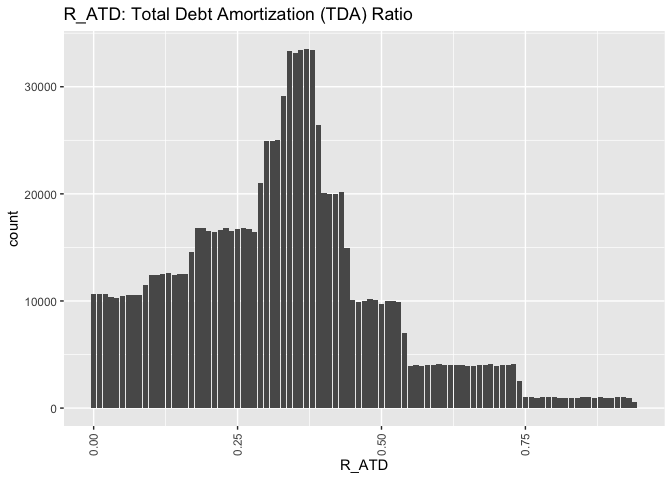
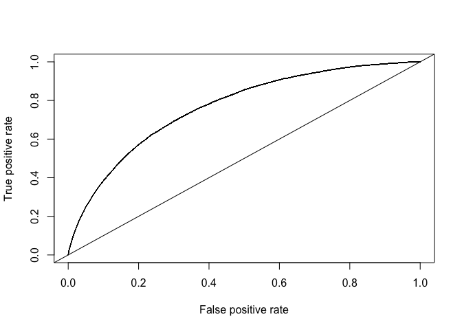

Credit risk modelling using logistic regression and boosting
================
Koray Yenal

In order to minimize loss and maximize profits from lending, banks
require careful assessment of their borrowers. This has led to credit
risk computation becoming a commonly used application of statistics and
data science.

In this notebook, I take a data set of loan applications and build a
predictive model for making a decision as to whether to approve a loan
and determine the loan amount based on the applicant’s characteristics
in order to maximize the banks’ profits obtained from these loans. The
dataset contains the records and results of lending money to some
customers. The dataset contains 1000000 clients; 50000 ($5\%$) of them
defaulted. I have an imbalanced dataset.

At first I do data exploration to get some insights, fill missing values
and visualize some features, then I develop a two-stage framework for
the prediction. First, I build a binary classification model to estimate
the probability of default for each individual. Then, I build a
regression model to predict the amount to loan each individual who are
predicted to be non-defaulters.

``` r
library(caret)
library(MASS)
library(corrplot)
library(DMwR)
library(ROCR)
library(glmnet)
library(caTools)
library(dplyr)
library(cvms)
library(e1071)
library(MLmetrics)
library(RColorBrewer)
library(ggplot2)
library(adabag)
library(xgboost)
library(mboost)
```

``` r
source("functions.R")
```

``` r
creditData<-read.csv("CreditGame.csv")
```

## 1. Exploratory Data Analysis

We first examine the dataset to identify variables types and the dataset
features, as well as the columns with empty cells.

``` r
str(creditData)
```

    ## 'data.frame':    1000000 obs. of  31 variables:
    ##  $ ID_TRAIN    : int  5000000 5000001 5000002 5000003 5000004 5000005 5000006 5000007 5873590 5000009 ...
    ##  $ NB_EMPT     : int  1 1 1 1 2 1 1 1 1 1 ...
    ##  $ R_ATD       : num  0.14 0.48 0.49 0.33 0.16 0.02 0.36 0.23 0.15 0.33 ...
    ##  $ DUREE       : int  5 3 7 3 5 2 4 2 3 2 ...
    ##  $ PRT_VAL     : num  0.93 1 1 0.95 0.98 1 1 1 0.45 0.67 ...
    ##  $ AGE_D       : int  68 57 19 58 42 29 32 47 27 46 ...
    ##  $ REV_BT      : int  125000 49000 57000 173000 66000 43000 124000 148000 42000 52000 ...
    ##  $ REV_NET     : int  88000 36000 39000 113000 51000 24000 87000 116000 37000 36000 ...
    ##  $ TYP_RES     : chr  "L" "A" "P" "P" ...
    ##  $ ST_EMPL     : chr  "R" "T" "R" "R" ...
    ##  $ MNT_EPAR    : int  210676 2026 430 121453 5665 2245 186645 85085 53816 4850 ...
    ##  $ NB_ER_6MS   : int  0 4 0 2 3 0 0 0 0 0 ...
    ##  $ NB_ER_12MS  : int  0 7 0 2 4 0 0 0 0 0 ...
    ##  $ NB_DEC_12MS : int  0 0 0 0 0 0 0 0 0 0 ...
    ##  $ NB_OPER     : int  8 5 9 5 3 13 6 6 9 6 ...
    ##  $ NB_COUR     : int  6 4 9 2 1 5 6 0 4 4 ...
    ##  $ NB_INTR_1M  : int  0 0 0 0 0 0 1 0 0 0 ...
    ##  $ NB_INTR_12M : int  0 0 0 0 0 0 1 0 0 0 ...
    ##  $ PIR_DEL     : int  0 0 0 0 0 0 0 0 0 0 ...
    ##  $ NB_DEL_30   : int  0 0 0 0 0 0 0 0 0 0 ...
    ##  $ NB_DEL_60   : int  0 0 0 0 0 0 0 0 0 0 ...
    ##  $ NB_DEL_90   : int  0 0 0 0 0 0 0 0 0 0 ...
    ##  $ MNT_PASS    : int  148818 0 2805 52870 441824 8151 16622 931 438399 11063 ...
    ##  $ MNT_ACT     : int  210676 323502 430 121453 748303 2245 319459 85085 452514 4850 ...
    ##  $ MNT_AUT_REN : int  500 4000 21500 4500 8500 3500 2000 0 1500 1000 ...
    ##  $ MNT_UTIL_REN: int  440 0 9022 476 3613 248 1999 0 1500 281 ...
    ##  $ NB_SATI     : int  4 4 9 4 3 10 1 5 6 6 ...
    ##  $ TYP_FIN     : chr  "AUTO" "AUTO" "AUTO" "AUTO" ...
    ##  $ MNT_DEMANDE : int  31500 16800 22200 6000 19600 30200 25100 38500 33800 31300 ...
    ##  $ DEFAULT     : int  0 0 0 0 0 0 0 0 1 0 ...
    ##  $ PROFIT_LOSS : num  1575 840 1110 300 980 ...

- Quite a lot of variables: a total of 31 variables, of which 3 are
  numerical, 3 are categorical and 25 are integer.

``` r
table(creditData$DEFAULT)
```

    ## 
    ##      0      1 
    ## 950000  50000

``` r
# net income
hist(creditData$REV_NET)
```

<!-- -->

``` r
age <- ggplot(creditData, aes(AGE_D))
age <- age + geom_histogram(stat="count") + labs(title = "AGE_D: Age of the borrower")+
  theme(axis.text.x=element_text(angle=90,hjust=1,vjust=0.5))
```

    ## Warning: Ignoring unknown parameters: binwidth, bins, pad

``` r
age
```

    ## Warning: Removed 19989 rows containing non-finite values (stat_count).

<!-- -->

``` r
# employment status
round(table(creditData$ST_EMPL)/nrow(creditData),2)
```

    ## 
    ##         P    R    T 
    ## 0.10 0.32 0.48 0.10

``` r
# residence type
round(table(creditData$TYP_RES)/nrow(creditData),2)
```

    ## 
    ##    A    L    P 
    ## 0.23 0.52 0.25

``` r
NB <- ggplot(creditData, aes(NB_EMPT))
NB <- NB + geom_histogram(stat="count") + labs(title = "NB_EMPT: Number of borrowers")+
  theme(axis.text.x=element_text(angle=90,hjust=1,vjust=0.5))
```

    ## Warning: Ignoring unknown parameters: binwidth, bins, pad

``` r
NB
```

<!-- -->

``` r
table(creditData$NB_EMPT)
```

    ## 
    ##      1      2 
    ## 865156 134844

``` r
round((prop.table(table(creditData$NB_EMPT))*100),1)
```

    ## 
    ##    1    2 
    ## 86.5 13.5

``` r
ATD <- ggplot(creditData, aes(R_ATD))
ATD <- ATD + geom_histogram(stat="count") + labs(title = "R_ATD: Total Debt Amortization (TDA) Ratio")+
  theme(axis.text.x=element_text(angle=90,hjust=1,vjust=0.5))
```

    ## Warning: Ignoring unknown parameters: binwidth, bins, pad

``` r
ATD
```

<!-- -->

``` r
EPAR <- ggplot(creditData, aes(MNT_EPAR))
EPAR <- EPAR + geom_histogram(stat="count") + labs(title = "MNT_EPAR: Savings Value")+
  theme(axis.text.x=element_text(angle=90,hjust=1,vjust=0.5))
```

    ## Warning: Ignoring unknown parameters: binwidth, bins, pad

``` r
EPAR
```

<!-- -->

Highlights from this inspection include:

- The distribution of age is right-skewed, with a mean value of 38.
- The net income histogram is right-skewed, with a mean value of \$48000
  and a median of \$41000.
- Average amount of credit requested is around \$22000.
- $52\%$ of the credit applicants are tenants.
- $52\%$ of loan applicants aren’t full-time employees, while $32\%$ of
  the credit applicants are part-time employees.
- Of the 1000000 clients in the training sample, 50000 ($5\%$)
  defaulted.
- $85\%$ of the observations are individual persons, while 15% are two
  people borrowers.

## 2. Data Pre-processing

### Dealing with missing data

``` r
colSums(is.na(creditData))
```

    ##     ID_TRAIN      NB_EMPT        R_ATD        DUREE      PRT_VAL        AGE_D 
    ##            0            0            0            0            0        19989 
    ##       REV_BT      REV_NET      TYP_RES      ST_EMPL     MNT_EPAR    NB_ER_6MS 
    ##            0            0            0            0            0            0 
    ##   NB_ER_12MS  NB_DEC_12MS      NB_OPER      NB_COUR   NB_INTR_1M  NB_INTR_12M 
    ##            0            0            0            0            0            0 
    ##      PIR_DEL    NB_DEL_30    NB_DEL_60    NB_DEL_90     MNT_PASS      MNT_ACT 
    ##            0            0            0            0            0            0 
    ##  MNT_AUT_REN MNT_UTIL_REN      NB_SATI      TYP_FIN  MNT_DEMANDE      DEFAULT 
    ##            0            0            0            0            0            0 
    ##  PROFIT_LOSS 
    ##            0

``` r
unique(creditData$TYP_FIN)
```

    ## [1] "AUTO"

``` r
unique(creditData$TYP_RES)
```

    ## [1] "L" "A" "P"

``` r
unique(creditData$ST_EMPL)
```

    ## [1] "R" "T" ""  "P"

- The $Age\_D$ variable has missing values.

- $ST\_EMPL$ has cells with an empty string, ““. It can simply be
  missing values. Or are they merely missing values? A NaN value can
  simply mean an absence of the feature (e.g., no employment). It could
  also be another category such as”Other”.

- $TYP\_RES$ has three categories and $ST\_EMPL$ has four categories, I
  factorize both variables.

- $TYP\_FIN$ has only a single category, $AUTO$. It doesn’t add any
  information to our analysis. I will remove the variable.

### Missing Values of AGE_D

``` r
creditData$Age_binary <- ifelse(is.na(creditData$AGE_D), 1, 0)
mod_binary <- glm(DEFAULT~Age_binary, data = creditData, family = "binomial")
summary(mod_binary)
```

    ## 
    ## Call:
    ## glm(formula = DEFAULT ~ Age_binary, family = "binomial", data = creditData)
    ## 
    ## Deviance Residuals: 
    ##     Min       1Q   Median       3Q      Max  
    ## -0.3203  -0.3203  -0.3203  -0.3203   2.4529  
    ## 
    ## Coefficients:
    ##              Estimate Std. Error  z value Pr(>|z|)    
    ## (Intercept) -2.944172   0.004634 -635.331   <2e-16 ***
    ## Age_binary  -0.013458   0.032972   -0.408    0.683    
    ## ---
    ## Signif. codes:  0 '***' 0.001 '**' 0.01 '*' 0.05 '.' 0.1 ' ' 1
    ## 
    ## (Dispersion parameter for binomial family taken to be 1)
    ## 
    ##     Null deviance: 397030  on 999999  degrees of freedom
    ## Residual deviance: 397030  on 999998  degrees of freedom
    ## AIC: 397034
    ## 
    ## Number of Fisher Scoring iterations: 5

I first check if the missing data in $AGE\_D$ are significant in
explaining the response variable, $DEFAULT$. To do this, I create a
binary variable $AGE\_binary$, which takes 1 if $Age\_D$ is empty, and 0
otherwise.

I fit a logistic regression model, where $DEFAULT$ is the response
variable and $AGE\_binary$ is the explanatory variable. I get a p-value
of 0.683, for a reasonable value of $\alpha = 0.05$, I reject the null
hypothesis and conclude that the $AGE\_binary$ variable is not
significant in explaining $DEFAULT$ variable.

I conclude that the missing data are not “MNAR”. It is either “MCAR” or
“MAR”, meaning that I can safely implement simple or multiple imputation
techniques. Thus, I remove $AGE\_binary$ from the dataset.

``` r
creditData$Age_binary <- NULL
correlations <- cor(Filter(is.numeric, creditData), use = "complete.obs")
corrplot(correlations, type="lower", method="number", order="hclust", number.cex=0.30, 
         tl.srt=45, tl.cex=0.50, col=brewer.pal(n=5, name="Spectral"))
```

<!-- -->

``` r
creditData$AGE_D[is.na(creditData$AGE_D)] <- median(creditData$AGE_D,  na.rm = TRUE)
```

Next, I build a correlation matrix. The correlation matrix shows that
there is no significant correlation between $AGE\_D$ and any other
explanatory variable, meaning that I don’t need to preserve the
correlation structure among variables. As a conclusion, there is no need
to fit a model with other explanatory variables to impute the missing
values of $AGE\_D$. A simple imputation method such as median imputation
will do just fine. Therefore, I impute the missing values of $AGE\_D$
with the median value, which is a robust alternative to mean. $AGE\_D$
variable no longer has any missing values.

### Missing Values of ST_EMPL

``` r
creditData[creditData==""]<-NA
creditData$ST_EMPL[is.na(creditData$ST_EMPL)] <- "O"
sum(is.na(creditData$ST_EMPL))
```

    ## [1] 0

$ST\_EMPL$ has cells with an empty string. Missing data accounts for
10%, removing them would create a significant bias. I have two options:
I can impute the missing values with the mode of observations, or I can
assume that the missing values belong to another category which was not
indicated in the already existing categories. “Other” might be an
important category representing other employment types not indicated in
the dataset. I make an educated guess and say that missing values belong
to “Other”, with the label “O”. $ST\_EMPL$ variable no longer has any
missing values.

### Eliminating Redundant Features

``` r
creditData$TYP_FIN <- NULL
creditData$PROFIT_LOSS <- NULL
creditData$ID_TRAIN <- NULL
creditData$NB_INTR_12M <- NULL
```

- $TYP\_FIN$ has only a single category, $AUTO$. Thus, it doesn’t add
  any information to the model, I simply remove it.

- $PROFIT\_LOSS$ is always $5\%$ of DEFAULT, i.e., variables are
  linearly dependent. Thus, I remove $PROFIT\_LOSS$.

- $ID\_TRAIN$ represents the Unique borrower ID, which has the risk of
  having information by chance or it doesn’t add any information to the
  model. I simply remove it.

- The correlation matrix shows that variables $NB\_INTR\_1M$ and
  $NB\_INTR\_12M$ have a correlation of 1. One variable perfectly
  explains the other variable, I remove the variable $NB\_INTR\_12M$
  from the dataset.

### Converting Categorical Variables into Factors

``` r
levels <- unique(creditData$DEFAULT) 
creditData$DEFAULT=factor(creditData$DEFAULT, labels=make.names(levels))
creditData$ST_EMPL <- as.factor(creditData$ST_EMPL)
creditData$TYP_RES <- as.factor(creditData$TYP_RES)
```

### Train-test-validation Split

``` r
# train-test-valid split
spec = c(train = .5, test = .25, validation = .25)

g = sample(cut(
  seq(nrow(creditData)), 
  nrow(creditData)*cumsum(c(0,spec)),
  labels = names(spec)
))

res = split(creditData, g)
sapply(res, nrow)/nrow(creditData)
```

    ##      train       test validation 
    ##       0.50       0.25       0.25

``` r
addmargins(prop.table(table(g)))
```

    ## g
    ##      train       test validation        Sum 
    ##       0.50       0.25       0.25       1.00

``` r
creditDataTrain = res$train
creditDataTest = res$test
creditDataValid = res$validation
```

I randomly divide the sample into train, validation, and test sets, with
respectively 50%, 25% and 25% of the data in the 3 samples. The model
training are based on the training set. Validation set is used in
several models to select the best model and in the watchlist object of
some of the models, while generalization error is calculated on the test
test.

### Undersampling with SMOTE

``` r
creditDataTrain_smote <- SMOTE(DEFAULT~., data = creditDataTrain, perc.over=500, perc.under = 200)
prop.table(table(creditDataTrain_smote$DEFAULT))
```

    ## 
    ##    X0    X1 
    ## 0.625 0.375

The exploratory data analysis shows that only $5\%$ of clients default,
indicating that our dataset is highly imbalanced. I need to overcome the
class imbalance problem, otherwise, models will not be able to detect
the minority class, i.e., the defaulters. I want to increase the
predictive power of the models for the minority class and make sure that
our model pays more attention to learning the minority class. For that,
I implement two techniques, namely SMOTE and adjusting model weights.

First, I increase the number of minority class samples by applying SMOTE
algorithm using DMwR library. I increase the minority class by $200\%$,
while I decrease the number of the majority class observations by
$500\%$. The final training dataset has $62.5\%$ of the majority class
and $37.5\%$ of the minority class.

Second, I introduce the sample weights in the model training and I
assign higher weights to the minority class and lower weights to the
majority class.

## Modeling

I adopt a two-stage approach, classification followed by regression.
First, I obtain the probability of default for each client based on
their characteristics. Then, the decision rule for giving out a loan is
the following:

$$
\begin{align*}
    Amount\_Loaned 
\begin{cases}
>0 &\text{ if } P(Default) < Cutoff \\
=0 &\text{ if }  P(Default) > Cutoff
\end{cases}
\end{align*}
$$

Second, for every client who is predicted as a non-defaulter
($DEFAULT = 0$), I predict a loan amount using the above regression
models. If the predicted loan amount (Amount Predicted) is lower than
the requested loan amount (Amount Requested), then I give the predicted
loan amount. If the predicted loan amount is higher than the requested
loan amount, then I give the requested loan amount. Then, the decision
rule for the loan amount would be the following:

$$
\begin{align*}
    Amount\_Loaned= 
\begin{cases}
Amount\_Predicted &\text{ if } Amount\_Predicted < Amount\_Requested \\
Amount\_Requested &\text{ if }  Amount\_Predicted > Amount\_Requested 
\end{cases}
\end{align*}
$$

The advantage of this method is that it is intuitive and easy to
interpret.

I select logistic regression, XGBoost and Adaboost for the
classification task, where logistic regression is the baseline because
it is a simpler algorithm and does not require much time to build
compared to other models. In logistic regression, I select variables
using Lasso regularization. I use XGBoost and Blackboost methods for the
regression task.

Adaboost is usually a good classification method in cases with
imbalanced data.

XGBoost is one of the most popular ML algorithms and is known to yield
highly accurate results.

Blackboost is a gradient boosting method where regression trees are
utilized as base-learners.

### Classification

#### Performance Measure

Since I have an imbalanced dataset, using “accuracy” as a performance
measure in a classification task would be misleading. As an alternative,
I use F-1 score, which is a more suitable metric for imbalanced data.

I also care about the false negative rate, i.e., the percentage of
observations who are predicted as ’not defaulting’ ($DEFAULT = 0$) but
in reality ‘default’ ($DEFAULT = 1$). This is because for every person
predicted as non-defaulter who actually defaults, the bank loses
significant money. For the bank, minimizing false negatives (i.e.,
wrongly predicted as non-defaulters) is crucial. Therefore, I also
compare false negative and false positive rates.

#### Logistic Regression

##### Data preparation

``` r
credit_train_X <- dfToMatrixX(creditDataTrain_smote)
credit_test_X <- dfToMatrixX(creditDataTest)

credit_train_Y <- dfToY(creditDataTrain_smote)
credit_test_Y <- dfToY(creditDataTest)
```

##### Training

``` r
credit_lasso <- glmnet(x=credit_train_X, y=credit_train_Y, family = "binomial")
```

##### Variable Selection

Here, I want to select, among all the variables, the set of variables
that generate the best prediction. For that purpose, I use lasso
regression.

``` r
credit_lasso_cv<- cv.glmnet(x=credit_train_X, y=credit_train_Y, family = "binomial", type.measure = "class")
plot(credit_lasso_cv)
```

<!-- -->

``` r
coef(credit_lasso, s=credit_lasso_cv$lambda.1se)
```

    ## 30 x 1 sparse Matrix of class "dgCMatrix"
    ##                         s1
    ## (Intercept)  -1.470432e+00
    ## NB_EMPT      -1.734197e-01
    ## R_ATD        -1.601906e+00
    ## DUREE         1.894953e-01
    ## PRT_VAL       2.569165e+00
    ## AGE_D        -1.787560e-02
    ## REV_BT       -3.656642e-06
    ## REV_NET      -1.357317e-06
    ## TYP_RESL     -4.977506e-01
    ## TYP_RESP     -6.171226e-01
    ## ST_EMPLP     -1.131219e-01
    ## ST_EMPLR     -3.195814e-01
    ## ST_EMPLT      3.016937e-02
    ## MNT_EPAR      2.344501e-06
    ## NB_ER_6MS     6.683498e-02
    ## NB_ER_12MS    1.695752e-01
    ## NB_DEC_12MS   8.975702e-02
    ## NB_OPER       2.852398e-03
    ## NB_COUR       3.545115e-03
    ## NB_INTR_1M    2.488881e-02
    ## PIR_DEL       6.108887e-01
    ## NB_DEL_30     7.572715e-02
    ## NB_DEL_60     1.819974e-01
    ## NB_DEL_90     3.565369e-01
    ## MNT_PASS      1.320996e-06
    ## MNT_ACT      -3.086018e-06
    ## MNT_AUT_REN  -2.886499e-05
    ## MNT_UTIL_REN  4.252864e-05
    ## NB_SATI      -4.189863e-02
    ## MNT_DEMANDE   .

The cross validation procedure selects 29 out of 30 variables as
significant, therefore, I go forward with the 29 variables selected by
the cross validation.

##### Prediction

``` r
pred_lasso_test <- predict(credit_lasso, newx=credit_test_X, s=credit_lasso_cv$lambda.1se, type = "response")

fn_rate_lasso <- fnRate(pred_lasso_test, creditDataTest, 0.5)
print(paste0("Lasso fn rate: ", round(fn_rate_lasso,2)))
```

    ## [1] "Lasso fn rate: 0.52"

``` r
f1_lasso <- f1Score(pred_lasso_test,creditDataTest,0.5)
print(paste0("Lasso f1 score: ", round(f1_lasso,2)))
```

    ## [1] "Lasso f1 score: 0.91"

``` r
# rocCurve(pred_lasso_test, credit_test_Y)

optcut_lasso <- rocCurve(pred_lasso_test, credit_test_Y)
```

<!-- -->

``` r
print(paste0("Lasso optimal fn rate: ", round(1-optcut_lasso[1],2)))
```

    ## [1] "Lasso optimal fn rate: 0.31"

After model training and prediction, I compare F1 scores of each
alternative, where the best performing model becomes the selected model.

#### XGBoost

##### Data Preparation

``` r
dtrain <- dfToDMatrix(creditDataTrain_smote)
dtest <- dfToDMatrix(creditDataTest)
dvalid <- dfToDMatrix(creditDataValid)
```

##### Training

``` r
watchlist = list(train=dtrain, test=dvalid)
negative_cases <- sum(factorToNumeric(creditDataTrain_smote$DEFAULT) == FALSE)
postive_cases <- sum(factorToNumeric(creditDataTrain_smote$DEFAULT) == TRUE)

modelXgboostTuned <- xgb.train(data = dtrain, 
                        nround = 50, 
                        early_stopping_rounds = 3,
                        objective = "binary:logistic",
                        scale_pos_weight = negative_cases/postive_cases,
                        max.depth = 3,
                        gamma = 1,
                        watchlist=watchlist)
```

    ## [1]  train-logloss:0.640411  test-logloss:0.641791 
    ## Multiple eval metrics are present. Will use test_logloss for early stopping.
    ## Will train until test_logloss hasn't improved in 3 rounds.
    ## 
    ## [2]  train-logloss:0.610067  test-logloss:0.611945 
    ## [3]  train-logloss:0.585267  test-logloss:0.589231 
    ## [4]  train-logloss:0.566592  test-logloss:0.571800 
    ## [5]  train-logloss:0.546962  test-logloss:0.552392 
    ## [6]  train-logloss:0.534293  test-logloss:0.539839 
    ## [7]  train-logloss:0.524201  test-logloss:0.531137 
    ## [8]  train-logloss:0.515028  test-logloss:0.522426 
    ## [9]  train-logloss:0.497491  test-logloss:0.507396 
    ## [10] train-logloss:0.486703  test-logloss:0.496938 
    ## [11] train-logloss:0.480478  test-logloss:0.491337 
    ## [12] train-logloss:0.475944  test-logloss:0.487441 
    ## [13] train-logloss:0.465556  test-logloss:0.476953 
    ## [14] train-logloss:0.452943  test-logloss:0.464290 
    ## [15] train-logloss:0.433247  test-logloss:0.444857 
    ## [16] train-logloss:0.417672  test-logloss:0.430521 
    ## [17] train-logloss:0.412990  test-logloss:0.426140 
    ## [18] train-logloss:0.406648  test-logloss:0.420362 
    ## [19] train-logloss:0.401145  test-logloss:0.414951 
    ## [20] train-logloss:0.397126  test-logloss:0.411394 
    ## [21] train-logloss:0.392096  test-logloss:0.407173 
    ## [22] train-logloss:0.384504  test-logloss:0.399999 
    ## [23] train-logloss:0.382233  test-logloss:0.397923 
    ## [24] train-logloss:0.379271  test-logloss:0.395162 
    ## [25] train-logloss:0.375499  test-logloss:0.391305 
    ## [26] train-logloss:0.370249  test-logloss:0.386084 
    ## [27] train-logloss:0.366113  test-logloss:0.382344 
    ## [28] train-logloss:0.364228  test-logloss:0.380832 
    ## [29] train-logloss:0.357132  test-logloss:0.374069 
    ## [30] train-logloss:0.355594  test-logloss:0.372700 
    ## [31] train-logloss:0.352773  test-logloss:0.369579 
    ## [32] train-logloss:0.349705  test-logloss:0.366818 
    ## [33] train-logloss:0.342696  test-logloss:0.360492 
    ## [34] train-logloss:0.335937  test-logloss:0.353856 
    ## [35] train-logloss:0.334895  test-logloss:0.353219 
    ## [36] train-logloss:0.330033  test-logloss:0.348445 
    ## [37] train-logloss:0.328784  test-logloss:0.347449 
    ## [38] train-logloss:0.327038  test-logloss:0.346025 
    ## [39] train-logloss:0.323673  test-logloss:0.343054 
    ## [40] train-logloss:0.320238  test-logloss:0.339899 
    ## [41] train-logloss:0.317833  test-logloss:0.337787 
    ## [42] train-logloss:0.316469  test-logloss:0.336658 
    ## [43] train-logloss:0.311910  test-logloss:0.332102 
    ## [44] train-logloss:0.308953  test-logloss:0.329309 
    ## [45] train-logloss:0.303380  test-logloss:0.324178 
    ## [46] train-logloss:0.301860  test-logloss:0.322700 
    ## [47] train-logloss:0.299253  test-logloss:0.320072 
    ## [48] train-logloss:0.293525  test-logloss:0.314245 
    ## [49] train-logloss:0.292292  test-logloss:0.313308 
    ## [50] train-logloss:0.290890  test-logloss:0.312023

##### Prediction

``` r
predXgboost <- predict(modelXgboostTuned, dtest)

fn_rate_xgb <- fnRateXgb(predXgboost, creditDataTest, factorToNumeric(creditDataTest$DEFAULT), 0.5)
print(paste0("XGBoost fn rate: ", round(fn_rate_xgb,2)))
```

    ## [1] "XGBoost fn rate: 0.76"

``` r
f1_xgb <- f1ScoreXgb(predXgboost,creditDataTest, factorToNumeric(creditDataTest$DEFAULT), 0.5)
print(paste0("XGBoost f1 score: ", round(f1_xgb,2)))
```

    ## [1] "XGBoost f1 score: 0.95"

``` r
optcut_xgb <- rocCurve(predXgboost, creditDataTest$DEFAULT)
```

<!-- -->

``` r
print(paste0("XGBoost optimal fn rate: ", round(1-optcut_xgb[1],2)))
```

    ## [1] "XGBoost optimal fn rate: 0.3"

#### Adaboost

##### Training

``` r
ada = boosting(DEFAULT~.,  data = creditDataTrain_smote, boos=TRUE, mfinal=50)
```

##### Prediction

``` r
pred_ada = predict(ada, creditDataTest)

fn_rate_ada <- fnRateAda(pred_ada)
print(paste0("Adaboost fn rate: ", round(fn_rate_ada,2)))
```

    ## [1] "Adaboost fn rate: 0.86"

``` r
f1_ada <- f1ScoreAda(pred_ada)
print(paste0("Adaboost f1 score: ", round(f1_ada,2)))
```

    ## [1] "Adaboost f1 score: 0.96"

``` r
optcut_ada <- rocCurve(pred_ada$prob[,2], creditDataTest$DEFAULT)
```

<!-- -->

``` r
print(paste0("Adaboost optimal fn rate: ", round(1-optcut_ada[1],2)))
```

    ## [1] "Adaboost optimal fn rate: 0.3"

#### False Negative Rate

``` r
print(paste0("Lasso optimal fn rate: ", round(1-optcut_lasso[1],2)))
```

    ## [1] "Lasso optimal fn rate: 0.31"

``` r
print(paste0("XGBoost optimal fn rate: ", round(1-optcut_xgb[1],2)))
```

    ## [1] "XGBoost optimal fn rate: 0.3"

``` r
print(paste0("Adaboost optimal fn rate: ", round(1-optcut_ada[1],2)))
```

    ## [1] "Adaboost optimal fn rate: 0.3"

The best false negative rate is found to be 0.30 (i.e., 30%) by
Adaboost.

The results show that the minimum false negative rate is around 30%,
which has a lot of room for improvement and tuning. The models yield a
false negative in one in every three observations, which is quite high.

#### F1 Scores

``` r
print(paste0("Lasso f1 score: ", round(f1_lasso,2)))
```

    ## [1] "Lasso f1 score: 0.91"

``` r
print(paste0("XGBoost f1 score: ", round(f1_xgb,2)))
```

    ## [1] "XGBoost f1 score: 0.95"

``` r
print(paste0("Adaboost f1 score: ", round(f1_ada,2)))
```

    ## [1] "Adaboost f1 score: 0.96"

The best F1 score is found to be 0.96 by Adaboost.

From the results, I see that a clear gap is visible between the naive
method and more complex ones. Overall, all methods obtain an F1 score
higher than 90%. Since F1 score is a combination of precision and
recall, I can say that the models have a good combined precision and
recall values

### Regression

In total, I train 2 models for the regression task: an XGboost and
gradient boosting with regression trees, known as ’blackboost’ in R.
Blackboost is a gradient boosting method where regression trees are
utilized as base-learners. I use mean squared error as the performance
measure. I use the training set for model training. I use the validation
set for model selection. For models where I had a cross validation
procedure, the training set is used for both model training and model
selection. The test set is used to obtain the generalization error. The
output of the regression task is the ’predicted loan amount requested’.

#### XGBoost

##### Data Preparation

``` r
creditDataTrain_regr <- creditDataTrain
creditDataTest_regr <- creditDataTest
creditDataTrain_regr$DEFAULT <- NULL
creditDataTest_regr$DEFAULT <- NULL

dtrain_regr <- dfToDMatrixRegr(creditDataTrain)
dtest_regr <- dfToDMatrixRegr(creditDataValid)
dvalid_regr <- dfToDMatrixRegr(creditDataTest)
```

The xgboost algorithm requires several conditions regarding the data
format in order to function properly:

- The input dataset must to be a matrix instead of a dataframe.

- The data type of all the input features must be numeric.

In order to achieve these objectives, I first remove the response
variable from our training dataset in order to prevent data leakage.
Then, I convert categorical variables (like $ST\_EMPL$ and $TYP\_RES$)
into numeric format using one-hot encoding. Finally, I convert our
dataframe into a multidimensional matrix.

##### Training

``` r
watchlist = list(train=dtrain_regr, test=dvalid_regr)
negative_cases <- sum(creditDataTrain$MNT_DEMANDE == FALSE)
postive_cases <- sum(creditDataTrain$MNT_DEMANDE == TRUE)

modelXgboostTuned_regr <- xgb.train(data = dtrain_regr, 
                             nround = 50, 
                             early_stopping_rounds = 3,
                             objective = "reg:squarederror",
                             scale_pos_weight = negative_cases/postive_cases,
                             max.depth = 3,
                             gamma = 1,
                             watchlist = watchlist)
```

    ## [1]  train-rmse:18717.755662 test-rmse:18734.541435 
    ## Multiple eval metrics are present. Will use test_rmse for early stopping.
    ## Will train until test_rmse hasn't improved in 3 rounds.
    ## 
    ## [2]  train-rmse:14970.558496 test-rmse:14983.396003 
    ## [3]  train-rmse:12738.060138 test-rmse:12746.420950 
    ## [4]  train-rmse:11486.794328 test-rmse:11490.798406 
    ## [5]  train-rmse:10820.810706 test-rmse:10821.437755 
    ## [6]  train-rmse:10478.921560 test-rmse:10476.881422 
    ## [7]  train-rmse:10307.111301 test-rmse:10303.172796 
    ## [8]  train-rmse:10221.753658 test-rmse:10216.531905 
    ## [9]  train-rmse:10179.489032 test-rmse:10173.576247 
    ## [10] train-rmse:10158.594167 test-rmse:10152.229293 
    ## [11] train-rmse:10148.243837 test-rmse:10141.571233 
    ## [12] train-rmse:10143.182498 test-rmse:10136.304055 
    ## [13] train-rmse:10140.554158 test-rmse:10133.617164 
    ## [14] train-rmse:10139.133624 test-rmse:10132.326437 
    ## [15] train-rmse:10138.442767 test-rmse:10131.623299 
    ## [16] train-rmse:10137.876994 test-rmse:10131.196269 
    ## [17] train-rmse:10137.413709 test-rmse:10130.984062 
    ## [18] train-rmse:10137.090649 test-rmse:10130.895824 
    ## [19] train-rmse:10136.852375 test-rmse:10130.818857 
    ## [20] train-rmse:10136.518607 test-rmse:10130.786416 
    ## [21] train-rmse:10136.294797 test-rmse:10130.792423 
    ## [22] train-rmse:10136.026968 test-rmse:10130.794819 
    ## [23] train-rmse:10135.739451 test-rmse:10130.833105 
    ## Stopping. Best iteration:
    ## [20] train-rmse:10136.518607 test-rmse:10130.786416

XGBoost has a range of hyperparameters, which requires tuning. Our goal
in hyperparameter tuning well on an unseen data. With this purpose in
mind, I first reduce the maximum depth of each decision tree to 3 using
max.depth argument. I add a watchlist argument, which shows both the
training and validation error rates, allowing us to see the performance
of the model on validation set. To account for the fact that I have
imbalanced classes, I scale the positive rates using the ”scale pos
weight” argument. I train for a large number of rounds by setting nround
parameter to 30 to prevent underfitting. I set early stopping rounds to
3 in order to stop when there isn’t a performance improvement. I also
add a regularization term, gamma, which is the minimum loss reduction to
create new tree-split. For the adaboost model, I use 5 fold cross
validation to select the best model, where I set boos = TRUE to draw a
bootstrap sample of the training set using the weights for each
observation and mfinal = 50 to determine the number of iterations for
which boosting is run.

##### Prediction

``` r
predXgboost_regr <- predict(modelXgboostTuned_regr, dtest_regr)
xgb_rmse = sqrt(mean((predXgboost_regr-creditDataTest$MNT_DEMANDE)^2))
```

##### Variable Importance

``` r
importance_matrix <- xgb.importance(model = modelXgboostTuned_regr)
xgb.plot.importance(importance_matrix, top_n = 10, measure = "Gain")
```

<!-- -->

#### Blackboost

``` r
gb <- blackboost(MNT_DEMANDE ~ ., data = creditDataTrain_regr)

pred_gb = predict(gb, creditDataTest)

black_rmse = sqrt(mean((pred_gb-creditDataTest$MNT_DEMANDE)^2))
```

``` r
print(paste0("XGBoost RMSE score: ", round(xgb_rmse,2)))
```

    ## [1] "XGBoost RMSE score: 10131.26"

``` r
print(paste0("Blackboost RMSE score: ", round(black_rmse,2)))
```

    ## [1] "Blackboost RMSE score: 10130.97"
