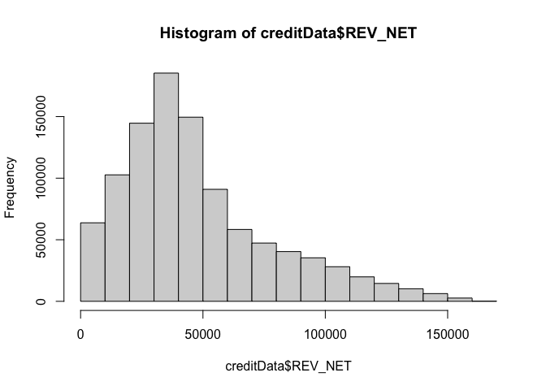
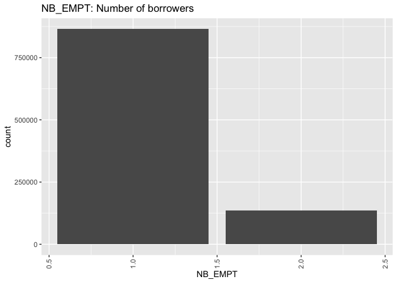
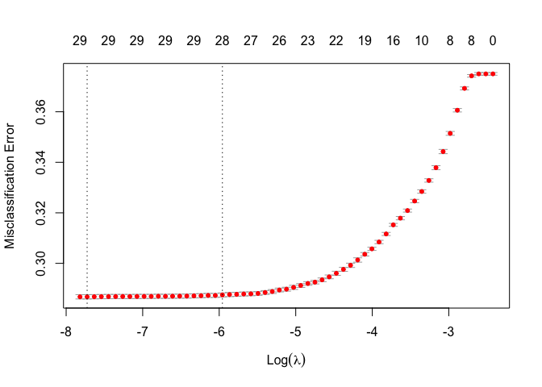
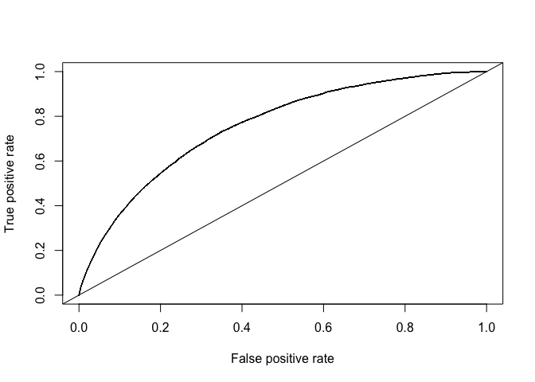

Credit Risk Modelling using R
================

In order to minimize loss and maximize profits from lending, banks
require careful assessment of their borrowers. This has led to credit
risk computation becoming a commonly used application of statistics and
data science.

In this notebook, I take a data set of loan applications and build a
predictive model for making a decision as to whether to approve a loan
and determine the loan amount based on the applicant’s characteristics
in order to maximize the banks’ profits obtained from these loans. The
dataset contains the records and results of lending money to some
customers. The dataset contains 1,000,000 clients; 50,000 (5%) of them
defaulted. I have an imbalanced dataset.

At first I do data exploration to get some insights, fill missing values
and visualize some features, then I develop a two-stage framework for
the prediction. First, I build a binary classification model to estimate
the probability of default for each individual. Then, I build a
regression model to predict the amount to loan each individual who are
predicted to be non-defaulters.

``` r
library(caret)
library(MASS)
library(corrplot)
library(DMwR)
library(ROCR)
library(glmnet)
library(caTools)
library(dplyr)
library(cvms)
library(e1071)
library(MLmetrics)
library(RColorBrewer)
library(ggplot2)
library(adabag)
library(xgboost)
library(mboost)
library(viridis)
library(hrbrthemes)
require(scales)
```

``` r
source("functions.R")
```

``` r
set.seed(234) 
creditData<-read.csv("CreditGame.csv")
```

## 1. Exploratory Data Analysis

## 1. Exploratory Data Analysis

The first step is to examine the dataset to identify variables types and
the dataset features, as well as features with missing values.

``` r
str(creditData)
```

    ## 'data.frame':    1000000 obs. of  31 variables:
    ##  $ ID_TRAIN    : int  5000000 5000001 5000002 5000003 5000004 5000005 5000006 5000007 5873590 5000009 ...
    ##  $ NB_EMPT     : int  1 1 1 1 2 1 1 1 1 1 ...
    ##  $ R_ATD       : num  0.14 0.48 0.49 0.33 0.16 0.02 0.36 0.23 0.15 0.33 ...
    ##  $ DUREE       : int  5 3 7 3 5 2 4 2 3 2 ...
    ##  $ PRT_VAL     : num  0.93 1 1 0.95 0.98 1 1 1 0.45 0.67 ...
    ##  $ AGE_D       : int  68 57 19 58 42 29 32 47 27 46 ...
    ##  $ REV_BT      : int  125000 49000 57000 173000 66000 43000 124000 148000 42000 52000 ...
    ##  $ REV_NET     : int  88000 36000 39000 113000 51000 24000 87000 116000 37000 36000 ...
    ##  $ TYP_RES     : chr  "L" "A" "P" "P" ...
    ##  $ ST_EMPL     : chr  "R" "T" "R" "R" ...
    ##  $ MNT_EPAR    : int  210676 2026 430 121453 5665 2245 186645 85085 53816 4850 ...
    ##  $ NB_ER_6MS   : int  0 4 0 2 3 0 0 0 0 0 ...
    ##  $ NB_ER_12MS  : int  0 7 0 2 4 0 0 0 0 0 ...
    ##  $ NB_DEC_12MS : int  0 0 0 0 0 0 0 0 0 0 ...
    ##  $ NB_OPER     : int  8 5 9 5 3 13 6 6 9 6 ...
    ##  $ NB_COUR     : int  6 4 9 2 1 5 6 0 4 4 ...
    ##  $ NB_INTR_1M  : int  0 0 0 0 0 0 1 0 0 0 ...
    ##  $ NB_INTR_12M : int  0 0 0 0 0 0 1 0 0 0 ...
    ##  $ PIR_DEL     : int  0 0 0 0 0 0 0 0 0 0 ...
    ##  $ NB_DEL_30   : int  0 0 0 0 0 0 0 0 0 0 ...
    ##  $ NB_DEL_60   : int  0 0 0 0 0 0 0 0 0 0 ...
    ##  $ NB_DEL_90   : int  0 0 0 0 0 0 0 0 0 0 ...
    ##  $ MNT_PASS    : int  148818 0 2805 52870 441824 8151 16622 931 438399 11063 ...
    ##  $ MNT_ACT     : int  210676 323502 430 121453 748303 2245 319459 85085 452514 4850 ...
    ##  $ MNT_AUT_REN : int  500 4000 21500 4500 8500 3500 2000 0 1500 1000 ...
    ##  $ MNT_UTIL_REN: int  440 0 9022 476 3613 248 1999 0 1500 281 ...
    ##  $ NB_SATI     : int  4 4 9 4 3 10 1 5 6 6 ...
    ##  $ TYP_FIN     : chr  "AUTO" "AUTO" "AUTO" "AUTO" ...
    ##  $ MNT_DEMANDE : int  31500 16800 22200 6000 19600 30200 25100 38500 33800 31300 ...
    ##  $ DEFAULT     : int  0 0 0 0 0 0 0 0 1 0 ...
    ##  $ PROFIT_LOSS : num  1575 840 1110 300 980 ...

- Quite a lot of variables: a total of 31 variables, of which 3 are
  numerical, 3 are categorical and 25 are integer.

``` r
prop.table(table(creditData$DEFAULT))
```

    ## 
    ##    0    1 
    ## 0.95 0.05

- 95% of applicants didn’t default; only 5% defaulted. I have an
  imbalanced dataset.

``` r
# net income
rev <- ggplot(creditData, aes(REV_NET))
rev <- rev + geom_histogram(stat="count") + labs(title = "REV_NET: Net Income", x = "net income")+
  theme(axis.text.x=element_text(angle=45,hjust=0.8,vjust=0.5))
rev
```

<!-- -->

- The net income histogram is right-skewed with a mean value of around
  \$48000 and a median of \$41000.

``` r
# age of the borrower
age <- ggplot(creditData, aes(AGE_D))
age <- age + geom_histogram(stat="count") + labs(title = "AGE_D: Age of the borrower")+
  theme(axis.text.x=element_text(angle=90,hjust=1,vjust=0.5))
age
```

<!-- -->

- The distribution of age is also right-skewed, with a mean value of 38.

``` r
# employment status
empl <- ggplot(creditData, aes(ST_EMPL))
empl <- empl + geom_bar(aes(y = (..count..)/sum(..count..))) + labs(title = "ST_EMPL: Employment Status", y = "Percent", x = "Employment Status") +
  scale_y_continuous(labels=percent) + 
  theme(axis.text.x=element_text(angle=90,hjust=1,vjust=0.5))
empl
```

<!-- -->

- Majority of applicants aren’t full-time employees, while 32% of
  applicants are part-time employees.

``` r
# residence type
res <- ggplot(creditData, aes(TYP_RES))
res <- res + geom_bar(aes(y = (..count..)/sum(..count..))) + labs(title = "TYP_RES: Residence Type", y = "Percent", x = "Residence Type") +
  scale_y_continuous(labels=percent) + 
  theme(axis.text.x=element_text(angle=90,hjust=1,vjust=0.5))
res
```

<!-- -->

- 52% of applicants are tenants, while 25% of applicants are landlords.

``` r
# residence type
number <- ggplot(creditData, aes(NB_EMPT))
number <- number + geom_bar(aes(y = (..count..)/sum(..count..))) + labs(title = "NB_EMPT: Number of Borrowers", y = "Percent", x = "Number of Borrowers") +
  scale_y_continuous(labels=percent) + 
  theme(axis.text.x=element_text(angle=90,hjust=1,vjust=0.5))
number
```

<!-- -->

- 85% of the total number of loans are issued to one person, while 15%
  of the total number of loans are issued to two people.

``` r
# savings value
EPAR <- ggplot(creditData, aes(MNT_EPAR))
EPAR <- EPAR + geom_histogram(stat="count") + labs(title = "MNT_EPAR: Savings Value")+
  theme(axis.text.x=element_text(angle=90,hjust=1,vjust=0.5))
EPAR
```

<!-- -->

- Savings value distribution is also right skewed; majority of
  applicants do not have any savings or very little savings.

``` r
# default by age
creditData %>% count(AGE_D, DEFAULT) %>%
  ggplot() +  labs(title = "Default by Age", y = "Percent") +
  geom_col(aes(x= AGE_D, y = n, fill= DEFAULT), position = 'fill')
```

<!-- -->

- The plot indicates that younger people default more. This is expected;
  young adults tend to have less financial stability compared to older
  adults. The difference appears significant, however I need further
  statistical analysis to support this.

``` r
# default by employment
creditData %>% count(ST_EMPL, DEFAULT) %>%
  ggplot() + labs(title = "Default by Employment", y = "Percent") +
  geom_col(aes(x= ST_EMPL, y = n, fill= DEFAULT), position = 'fill')
```

<!-- -->

- Applicants with regular/full-time jobs (R) tend to default less than
  others, which is expected. Self employed people (T) and the unlabeled
  category (““) tend to default more. However, the difference does not
  appear significant.

## 2. Data Pre-processing

### Dealing with missing data

``` r
colSums(is.na(creditData))
```

    ##     ID_TRAIN      NB_EMPT        R_ATD        DUREE      PRT_VAL        AGE_D 
    ##            0            0            0            0            0        19989 
    ##       REV_BT      REV_NET      TYP_RES      ST_EMPL     MNT_EPAR    NB_ER_6MS 
    ##            0            0            0            0            0            0 
    ##   NB_ER_12MS  NB_DEC_12MS      NB_OPER      NB_COUR   NB_INTR_1M  NB_INTR_12M 
    ##            0            0            0            0            0            0 
    ##      PIR_DEL    NB_DEL_30    NB_DEL_60    NB_DEL_90     MNT_PASS      MNT_ACT 
    ##            0            0            0            0            0            0 
    ##  MNT_AUT_REN MNT_UTIL_REN      NB_SATI      TYP_FIN  MNT_DEMANDE      DEFAULT 
    ##            0            0            0            0            0            0 
    ##  PROFIT_LOSS 
    ##            0

``` r
unique(creditData$TYP_FIN)
```

    ## [1] "AUTO"

``` r
unique(creditData$TYP_RES)
```

    ## [1] "L" "A" "P"

``` r
unique(creditData$ST_EMPL)
```

    ## [1] "R" "T" ""  "P"

- The Age_D variable has missing values.

- ST_EMPL has cells with an empty string, ““. It can simply be missing
  values. Or are they merely missing values? A NaN value can simply mean
  an absence of the feature (e.g., no employment). It could also be
  another category such as”Other”.

- TYP_RES has three categories and ST_EMPL has four categories, I
  factorize both variables.

- TYP_FIN has only a single category, AUTO. It doesn’t add any
  information to our analysis. I will remove the variable.

### Missing Values of AGE_D

``` r
creditData$Age_binary <- ifelse(is.na(creditData$AGE_D), 1, 0)
mod_binary <- glm(DEFAULT~Age_binary, data = creditData, family = "binomial")
summary(mod_binary)
```

    ## 
    ## Call:
    ## glm(formula = DEFAULT ~ Age_binary, family = "binomial", data = creditData)
    ## 
    ## Deviance Residuals: 
    ##     Min       1Q   Median       3Q      Max  
    ## -0.3203  -0.3203  -0.3203  -0.3203   2.4529  
    ## 
    ## Coefficients:
    ##              Estimate Std. Error  z value Pr(>|z|)    
    ## (Intercept) -2.944172   0.004634 -635.331   <2e-16 ***
    ## Age_binary  -0.013458   0.032972   -0.408    0.683    
    ## ---
    ## Signif. codes:  0 '***' 0.001 '**' 0.01 '*' 0.05 '.' 0.1 ' ' 1
    ## 
    ## (Dispersion parameter for binomial family taken to be 1)
    ## 
    ##     Null deviance: 397030  on 999999  degrees of freedom
    ## Residual deviance: 397030  on 999998  degrees of freedom
    ## AIC: 397034
    ## 
    ## Number of Fisher Scoring iterations: 5

I first check if the missing data in AGE_D are significant in explaining
the response variable, DEFAULT. To do this, I create a binary variable
AGE_binary, which takes 1 if Age_D is empty, and 0 otherwise.

I fit a logistic regression model, where DEFAULT is the response
variable and AGE_binary is the explanatory variable. I get a p-value of
0.683, for a reasonable value of $\alpha = 0.05$, I reject the null
hypothesis and conclude that the AGE_binary variable is not significant
in explaining DEFAULT.

I conclude that the missing data are not “MNAR”. It is either “MCAR” or
“MAR”, meaning that I can safely implement simple or multiple imputation
techniques. Thus, I remove AGE_binary from the dataset.

``` r
creditData$Age_binary <- NULL
correlations <- cor(Filter(is.numeric, creditData), use = "complete.obs")
corrplot(correlations, type="lower", method="number", order="hclust", number.cex=0.30, 
         tl.srt=45, tl.cex=0.50, col=brewer.pal(n=5, name="Spectral"))
```

<!-- -->

``` r
creditData$AGE_D[is.na(creditData$AGE_D)] <- median(creditData$AGE_D,  na.rm = TRUE)
```

Next, I build a correlation matrix. The correlation matrix shows that
there is no significant correlation between AGE_D and any other
explanatory variable, meaning that I don’t need to preserve the
correlation structure among variables. As a conclusion, there is no need
to fit a model with other explanatory variables to impute the missing
values of AGE_D. A simple imputation method such as median imputation
will do just fine. Therefore, I impute the missing values of AGE_D with
the median value, which is a robust alternative to mean. AGE_D variable
no longer has any missing values.

### Missing Values of ST_EMPL

``` r
creditData[creditData==""]<-NA
creditData$ST_EMPL[is.na(creditData$ST_EMPL)] <- "O"
sum(is.na(creditData$ST_EMPL))
```

    ## [1] 0

ST_EMPL has cells with an empty string. Missing data accounts for 10%,
removing them would create a significant bias. I have two options: I can
impute the missing values with the mode of observations, or I can assume
that the missing values belong to another category which was not
indicated in the already existing categories. “Other” might be an
important category representing other employment types not indicated in
the dataset. I make an educated guess and say that missing values belong
to “Other”, with the label “O”. ST_EMPL variable no longer has any
missing values.

### Eliminating Redundant Features

``` r
creditData$TYP_FIN <- NULL
creditData$PROFIT_LOSS <- NULL
creditData$ID_TRAIN <- NULL
creditData$NB_INTR_12M <- NULL
```

- TYP_FIN has only a single category, AUTO. Thus, it doesn’t add any
  information to the model, I simply remove it.

- PROFIT_LOSS is always 5% of DEFAULT, i.e., variables are linearly
  dependent. Thus, I remove PROFIT_LOSS.

- ID_TRAIN represents the Unique borrower ID, which has the risk of
  having information by chance or it doesn’t add any information to the
  model. I simply remove it.

- The correlation matrix shows that variables NB_INTR_1M and NB_INTR_12M
  have a correlation of 1. One variable perfectly explains the other
  variable, I remove the variable NB_INTR_12M from the dataset.

### Converting Categorical Variables into Factors

``` r
levels <- unique(creditData$DEFAULT) 
creditData$DEFAULT=factor(creditData$DEFAULT, labels=make.names(levels))
creditData$ST_EMPL <- as.factor(creditData$ST_EMPL)
creditData$TYP_RES <- as.factor(creditData$TYP_RES)
```

### Train-test-validation Split

``` r
# train-test-valid split
spec = c(train = .5, test = .25, validation = .25)

g = sample(cut(
  seq(nrow(creditData)), 
  nrow(creditData)*cumsum(c(0,spec)),
  labels = names(spec)
))

res = split(creditData, g)
sapply(res, nrow)/nrow(creditData)
```

    ##      train       test validation 
    ##       0.50       0.25       0.25

``` r
addmargins(prop.table(table(g)))
```

    ## g
    ##      train       test validation        Sum 
    ##       0.50       0.25       0.25       1.00

``` r
creditDataTrain = res$train
creditDataTest = res$test
creditDataValid = res$validation
```

I randomly divide the sample into train, validation, and test sets, with
respectively 50%, 25% and 25% of the data in the 3 samples. The model
training are based on the training set. Validation set is used in
several models to select the best model and in the watchlist object of
some of the models, while generalization error is calculated on the test
test.

### Undersampling with SMOTE

``` r
creditDataTrain_smote <- SMOTE(DEFAULT~., data = creditDataTrain, perc.over=500, perc.under = 200)
prop.table(table(creditDataTrain_smote$DEFAULT))
```

    ## 
    ##    X0    X1 
    ## 0.625 0.375

The exploratory data analysis shows that only 5% of clients default,
indicating that our dataset is highly imbalanced. I need to overcome the
class imbalance problem, otherwise, models will not be able to detect
the minority class, i.e., the defaulters. I want to increase the
predictive power of the models for the minority class and make sure that
our model pays more attention to learning the minority class. For that,
I implement two techniques, namely SMOTE and adjusting model weights.

First, I increase the number of minority class samples by applying SMOTE
algorithm using DMwR library. I increase the minority class by 200%,
while I decrease the number of the majority class observations by 500%.
The final training dataset has 62.5% of the majority class and 37.5% of
the minority class.

Second, I introduce the sample weights in the model training and I
assign higher weights to the minority class and lower weights to the
majority class.

## Modeling

I adopt a two-stage approach, classification followed by regression.
First, I obtain the probability of default for each client based on
their characteristics. The decision rule for giving out a loan is the
following: if the probability is greater than cutoff value, the loan
amount will be greater than zero. Otherwise, the loan amount will be
zero.

Second, for every client who is predicted as a non-defaulter, I predict
a loan amount using the above regression models. If the predicted loan
amount is lower than the requested loan amount, then I give the
predicted loan amount. If the predicted loan amount is higher than the
requested loan amount, then I give the requested loan amount. Then, the
decision rule for the loan amount would be the following:

$$
AmountLoaned= 
\begin{cases}
AmountPredicted &\text{ if } AmountPredicted < AmountRequested \\
AmountRequested &\text{ if }AmountPredicted > AmountRequested 
\end{cases}
$$

The advantage of this method is that it is intuitive and easy to
interpret.

I select logistic regression, XGBoost and Adaboost for the
classification task, where logistic regression is the baseline because
it is a simpler algorithm and does not require much time to build
compared to other models. In logistic regression, I select variables
using Lasso regularization. I use XGBoost and Blackboost methods for the
regression task.

Adaboost is usually a good classification method in cases with
imbalanced data.

XGBoost is one of the most popular ML algorithms and is known to yield
highly accurate results.

Blackboost is a gradient boosting method where regression trees are
utilized as base-learners.

### Classification

#### Performance Measure

Since I have an imbalanced dataset, using “accuracy” as a performance
measure in a classification task would be misleading. As an alternative,
I use F-1 score, which is a more suitable metric for imbalanced data.

I also care about the false negative rate, i.e., the percentage of
observations who are predicted as “not defaulting” but in reality
“default”. This is because for every person predicted as non-defaulter
who actually defaults, the bank loses significant money. For the bank,
minimizing false negatives (i.e., wrongly predicted as non-defaulters)
is crucial. Therefore, I also compare false negative and false positive
rates.

#### Logistic Regression

##### Data preparation

``` r
credit_train_X <- dfToMatrixX(creditDataTrain_smote)
credit_test_X <- dfToMatrixX(creditDataTest)

credit_train_Y <- dfToY(creditDataTrain_smote)
credit_test_Y <- dfToY(creditDataTest)
```

##### Training

``` r
credit_lasso <- glmnet(x=credit_train_X, y=credit_train_Y, family = "binomial")
```

##### Variable Selection

Here, I want to select, among all the variables, the set of variables
that generate the best prediction. For that purpose, I use lasso
regression.

``` r
credit_lasso_cv<- cv.glmnet(x=credit_train_X, y=credit_train_Y, family = "binomial", type.measure = "class")
plot(credit_lasso_cv)
```

<!-- -->

``` r
coef(credit_lasso, s=credit_lasso_cv$lambda.1se)
```

    ## 30 x 1 sparse Matrix of class "dgCMatrix"
    ##                         s1
    ## (Intercept)  -1.549731e+00
    ## NB_EMPT      -1.158470e-01
    ## R_ATD        -1.554476e+00
    ## DUREE         1.897473e-01
    ## PRT_VAL       2.523281e+00
    ## AGE_D        -1.652102e-02
    ## REV_BT       -4.586218e-06
    ## REV_NET      -6.789860e-07
    ## TYP_RESL     -5.103484e-01
    ## TYP_RESP     -5.987834e-01
    ## ST_EMPLP     -8.577060e-02
    ## ST_EMPLR     -2.844994e-01
    ## ST_EMPLT      3.778981e-02
    ## MNT_EPAR      2.078842e-06
    ## NB_ER_6MS     7.260999e-02
    ## NB_ER_12MS    1.717143e-01
    ## NB_DEC_12MS   9.704198e-02
    ## NB_OPER       .           
    ## NB_COUR       .           
    ## NB_INTR_1M    1.983563e-02
    ## PIR_DEL       5.877923e-01
    ## NB_DEL_30     7.166133e-02
    ## NB_DEL_60     1.739399e-01
    ## NB_DEL_90     3.509019e-01
    ## MNT_PASS      1.222664e-06
    ## MNT_ACT      -2.857718e-06
    ## MNT_AUT_REN  -2.674624e-05
    ## MNT_UTIL_REN  3.961890e-05
    ## NB_SATI      -3.679513e-02
    ## MNT_DEMANDE   .

The cross validation procedure selects 29 out of 30 variables as
significant, therefore, I go forward with the 29 variables selected by
the cross validation.

##### Prediction

``` r
pred_lasso_test <- predict(credit_lasso, newx=credit_test_X, s=credit_lasso_cv$lambda.1se, type = "response")

fn_rate_lasso <- fnRate(pred_lasso_test, creditDataTest, 0.5)
print(paste0("Lasso fn rate: ", round(fn_rate_lasso,2)))
```

    ## [1] "Lasso fn rate: 0.53"

``` r
f1_lasso <- f1Score(pred_lasso_test,creditDataTest,0.5)
print(paste0("Lasso f1 score: ", round(f1_lasso,2)))
```

    ## [1] "Lasso f1 score: 0.91"

``` r
optcut_lasso <- rocCurve(pred_lasso_test, credit_test_Y)
```

<!-- -->

``` r
print(paste0("Lasso optimal fn rate: ", round(1-optcut_lasso[1],2)))
```

    ## [1] "Lasso optimal fn rate: 0.29"

#### XGBoost

##### Data Preparation

``` r
dtrain <- dfToDMatrix(creditDataTrain_smote)
dtest <- dfToDMatrix(creditDataTest)
dvalid <- dfToDMatrix(creditDataValid)
```

##### Training

``` r
watchlist = list(train=dtrain, test=dvalid)
negative_cases <- sum(factorToNumeric(creditDataTrain_smote$DEFAULT) == FALSE)
postive_cases <- sum(factorToNumeric(creditDataTrain_smote$DEFAULT) == TRUE)

modelXgboostTuned <- xgb.train(data = dtrain, 
                        nround = 50, 
                        early_stopping_rounds = 3,
                        objective = "binary:logistic",
                        scale_pos_weight = negative_cases/postive_cases,
                        max.depth = 3,
                        gamma = 1,
                        watchlist=watchlist)
```

    ## [1]  train-logloss:0.639884  test-logloss:0.641350 
    ## Multiple eval metrics are present. Will use test_logloss for early stopping.
    ## Will train until test_logloss hasn't improved in 3 rounds.
    ## 
    ## [2]  train-logloss:0.607577  test-logloss:0.610023 
    ## [3]  train-logloss:0.581579  test-logloss:0.586139 
    ## [4]  train-logloss:0.563736  test-logloss:0.569378 
    ## [5]  train-logloss:0.549376  test-logloss:0.555872 
    ## [6]  train-logloss:0.535741  test-logloss:0.543427 
    ## [7]  train-logloss:0.520038  test-logloss:0.527838 
    ## [8]  train-logloss:0.501806  test-logloss:0.512325 
    ## [9]  train-logloss:0.490386  test-logloss:0.501303 
    ## [10] train-logloss:0.482953  test-logloss:0.493795 
    ## [11] train-logloss:0.475004  test-logloss:0.486999 
    ## [12] train-logloss:0.465524  test-logloss:0.478087 
    ## [13] train-logloss:0.456186  test-logloss:0.467745 
    ## [14] train-logloss:0.447523  test-logloss:0.460177 
    ## [15] train-logloss:0.430220  test-logloss:0.443797 
    ## [16] train-logloss:0.426842  test-logloss:0.441186 
    ## [17] train-logloss:0.423513  test-logloss:0.438328 
    ## [18] train-logloss:0.418411  test-logloss:0.433371 
    ## [19] train-logloss:0.410119  test-logloss:0.425863 
    ## [20] train-logloss:0.405599  test-logloss:0.421525 
    ## [21] train-logloss:0.402893  test-logloss:0.419287 
    ## [22] train-logloss:0.386699  test-logloss:0.403121 
    ## [23] train-logloss:0.380749  test-logloss:0.397194 
    ## [24] train-logloss:0.375552  test-logloss:0.392508 
    ## [25] train-logloss:0.371566  test-logloss:0.388996 
    ## [26] train-logloss:0.368705  test-logloss:0.385854 
    ## [27] train-logloss:0.359557  test-logloss:0.376304 
    ## [28] train-logloss:0.357647  test-logloss:0.374898 
    ## [29] train-logloss:0.355851  test-logloss:0.373477 
    ## [30] train-logloss:0.354462  test-logloss:0.372574 
    ## [31] train-logloss:0.350495  test-logloss:0.368387 
    ## [32] train-logloss:0.347182  test-logloss:0.364936 
    ## [33] train-logloss:0.345686  test-logloss:0.363731 
    ## [34] train-logloss:0.342782  test-logloss:0.361041 
    ## [35] train-logloss:0.336118  test-logloss:0.354945 
    ## [36] train-logloss:0.328928  test-logloss:0.348370 
    ## [37] train-logloss:0.327218  test-logloss:0.346939 
    ## [38] train-logloss:0.325598  test-logloss:0.345433 
    ## [39] train-logloss:0.320825  test-logloss:0.340944 
    ## [40] train-logloss:0.317593  test-logloss:0.337821 
    ## [41] train-logloss:0.316571  test-logloss:0.337064 
    ## [42] train-logloss:0.312832  test-logloss:0.333609 
    ## [43] train-logloss:0.306170  test-logloss:0.327221 
    ## [44] train-logloss:0.304804  test-logloss:0.325809 
    ## [45] train-logloss:0.300799  test-logloss:0.321580 
    ## [46] train-logloss:0.299670  test-logloss:0.320612 
    ## [47] train-logloss:0.297628  test-logloss:0.318819 
    ## [48] train-logloss:0.295150  test-logloss:0.316591 
    ## [49] train-logloss:0.294556  test-logloss:0.316170 
    ## [50] train-logloss:0.291299  test-logloss:0.313141

##### Prediction

``` r
predXgboost <- predict(modelXgboostTuned, dtest)

fn_rate_xgb <- fnRateXgb(predXgboost, creditDataTest, factorToNumeric(creditDataTest$DEFAULT), 0.5)
print(paste0("XGBoost fn rate: ", round(fn_rate_xgb,2)))
```

    ## [1] "XGBoost fn rate: 0.76"

``` r
f1_xgb <- f1ScoreXgb(predXgboost,creditDataTest, factorToNumeric(creditDataTest$DEFAULT), 0.5)
print(paste0("XGBoost f1 score: ", round(f1_xgb,2)))
```

    ## [1] "XGBoost f1 score: 0.95"

``` r
optcut_xgb <- rocCurve(predXgboost, creditDataTest$DEFAULT)
```

<!-- -->

``` r
print(paste0("XGBoost optimal fn rate: ", round(1-optcut_xgb[1],2)))
```

    ## [1] "XGBoost optimal fn rate: 0.31"

#### Adaboost

##### Training

``` r
ada = boosting(DEFAULT~.,  data = creditDataTrain_smote, boos=TRUE, mfinal=50)
```

##### Prediction

``` r
pred_ada = predict(ada, creditDataTest)

fn_rate_ada <- fnRateAda(pred_ada)
print(paste0("Adaboost fn rate: ", round(fn_rate_ada,2)))
```

    ## [1] "Adaboost fn rate: 0.85"

``` r
f1_ada <- f1ScoreAda(pred_ada)
print(paste0("Adaboost f1 score: ", round(f1_ada,2)))
```

    ## [1] "Adaboost f1 score: 0.96"

``` r
optcut_ada <- rocCurve(pred_ada$prob[,2], creditDataTest$DEFAULT)
```

<!-- -->

``` r
print(paste0("Adaboost optimal fn rate: ", round(1-optcut_ada[1],2)))
```

    ## [1] "Adaboost optimal fn rate: 0.3"

#### False Negative Rate

``` r
print(paste0("Lasso optimal fn rate: ", round(1-optcut_lasso[1],2)))
```

    ## [1] "Lasso optimal fn rate: 0.29"

``` r
print(paste0("XGBoost optimal fn rate: ", round(1-optcut_xgb[1],2)))
```

    ## [1] "XGBoost optimal fn rate: 0.31"

``` r
print(paste0("Adaboost optimal fn rate: ", round(1-optcut_ada[1],2)))
```

    ## [1] "Adaboost optimal fn rate: 0.3"

The best false negative rate is found to be 0.30 (i.e., 30%) by
Adaboost.

The results show that the minimum false negative rate is around 30%,
which has a lot of room for improvement and tuning. The models yield a
false negative in one in every three observations, which is quite high.

#### F1 Scores

``` r
print(paste0("Lasso f1 score: ", round(f1_lasso,2)))
```

    ## [1] "Lasso f1 score: 0.91"

``` r
print(paste0("XGBoost f1 score: ", round(f1_xgb,2)))
```

    ## [1] "XGBoost f1 score: 0.95"

``` r
print(paste0("Adaboost f1 score: ", round(f1_ada,2)))
```

    ## [1] "Adaboost f1 score: 0.96"

After model training and prediction, I compare F1 scores of each
alternative, where the best performing model becomes the selected model.

The best F1 score is found to be 0.96 by Adaboost.

From the results, I see that a clear gap is visible between the naive
method and more complex ones. Overall, all methods obtain an F1 score
higher than 90%. Since F1 score is a combination of precision and
recall, I can say that the models have a good combined precision and
recall values

### Regression

In total, I train 2 models for the regression task: an XGboost and
gradient boosting with regression trees, known as “blackboost” in R.
Blackboost is a gradient boosting method where regression trees are
utilized as base-learners. I use mean squared error as the performance
measure. I use the training set for model training. I use the validation
set for model selection. For models where I had a cross validation
procedure, the training set is used for both model training and model
selection. The test set is used to obtain the generalization error. The
output of the regression task is the “predicted loan amount requested”.

#### XGBoost

##### Data Preparation

``` r
creditDataTrain_regr <- creditDataTrain_smote
creditDataTest_regr <- creditDataTest
creditDataTrain_regr$DEFAULT <- NULL
creditDataTest_regr$DEFAULT <- NULL

dtrain_regr <- dfToDMatrixRegr(creditDataTrain_smote)
dtest_regr <- dfToDMatrixRegr(creditDataValid)
dvalid_regr <- dfToDMatrixRegr(creditDataTest)
```

The xgboost algorithm requires several conditions regarding the data
format in order to function properly:

- The input dataset must to be a matrix instead of a dataframe.

- The data type of all the input features must be numeric.

In order to achieve these objectives, I first remove the response
variable from our training dataset in order to prevent data leakage.
Then, I convert categorical variables into numeric format using one-hot
encoding. Finally, I convert our dataframe into a multidimensional
matrix.

##### Training

``` r
watchlist = list(train=dtrain_regr, test=dvalid_regr)
negative_cases <- sum(creditDataTrain$MNT_DEMANDE == FALSE)
postive_cases <- sum(creditDataTrain$MNT_DEMANDE == TRUE)

modelXgboostTuned_regr <- xgb.train(data = dtrain_regr, 
                             nround = 50, 
                             early_stopping_rounds = 3,
                             objective = "reg:squarederror",
                             scale_pos_weight = negative_cases/postive_cases,
                             max.depth = 3,
                             gamma = 1,
                             watchlist = watchlist)
```

    ## [1]  train-rmse:18626.486449 test-rmse:18708.443739 
    ## Multiple eval metrics are present. Will use test_rmse for early stopping.
    ## Will train until test_rmse hasn't improved in 3 rounds.
    ## 
    ## [2]  train-rmse:14864.565828 test-rmse:14963.569390 
    ## [3]  train-rmse:12617.539142 test-rmse:12733.419071 
    ## [4]  train-rmse:11354.932719 test-rmse:11484.621932 
    ## [5]  train-rmse:10681.522203 test-rmse:10820.742686 
    ## [6]  train-rmse:10335.125283 test-rmse:10480.780125 
    ## [7]  train-rmse:10160.651049 test-rmse:10310.465659 
    ## [8]  train-rmse:10073.512585 test-rmse:10225.414435 
    ## [9]  train-rmse:10030.244550 test-rmse:10183.712529 
    ## [10] train-rmse:10008.201181 test-rmse:10163.345766 
    ## [11] train-rmse:9997.150061  test-rmse:10153.511832 
    ## [12] train-rmse:9991.426263  test-rmse:10148.707686 
    ## [13] train-rmse:9988.015764  test-rmse:10146.734230 
    ## [14] train-rmse:9986.018073  test-rmse:10145.799172 
    ## [15] train-rmse:9984.754897  test-rmse:10145.367995 
    ## [16] train-rmse:9983.717806  test-rmse:10145.295610 
    ## [17] train-rmse:9982.923911  test-rmse:10145.255900 
    ## [18] train-rmse:9982.339468  test-rmse:10145.268712 
    ## [19] train-rmse:9981.581484  test-rmse:10145.292788 
    ## [20] train-rmse:9980.918174  test-rmse:10145.552998 
    ## Stopping. Best iteration:
    ## [17] train-rmse:9982.923911  test-rmse:10145.255900

XGBoost has a range of hyperparameters, which requires tuning. Our goal
in hyperparameter tuning well on an unseen data. With this purpose in
mind, I first reduce the maximum depth of each decision tree to 3 using
max.depth argument. I add a watchlist argument, which shows both the
training and validation error rates, allowing us to see the performance
of the model on validation set. To account for the fact that I have
imbalanced classes, I scale the positive rates using the “scale pos
weight” argument. I train for a large number of rounds by setting nround
parameter to 30 to prevent underfitting. I set early stopping rounds to
3 in order to stop when there isn’t a performance improvement. I also
add a regularization term, gamma, which is the minimum loss reduction to
create new tree-split. For the adaboost model, I use 5 fold cross
validation to select the best model, where I set “boos = TRUE” to draw a
bootstrap sample of the training set using the weights for each
observation and “mfinal = 50” to determine the number of iterations for
which boosting is run.

##### Prediction

``` r
predXgboost_regr <- predict(modelXgboostTuned_regr, dtest_regr)
xgb_rmse = sqrt(mean((predXgboost_regr-creditDataTest$MNT_DEMANDE)^2))
xgb_rmse
```

    ## [1] 10146.26

##### Variable Importance

``` r
importance_matrix <- xgb.importance(model = modelXgboostTuned_regr)
xgb.plot.importance(importance_matrix, top_n = 10, measure = "Gain")
```

<!-- -->

Variable importance graph shows that some of the most important
variables are:

- Total used amount of revolving credit (MNT_UTIL_REN),
- Value of financial assets (MNT_ACT),
- Value of financial liabilities (MNT_PASS), etc.

The results make sense; clients with high financial liabilities or
credit utilization tend to have a higher risk of default, while the
ratio of requested loan amount to value of the assets tend to give an
accurate indication as to whether the client can payback their debt by
their savings or assets.

#### Blackboost

``` r
gb <- blackboost(MNT_DEMANDE ~ ., data = creditDataTrain_regr)

pred_gb = predict(gb, creditDataTest)

black_rmse = sqrt(mean((pred_gb-creditDataTest$MNT_DEMANDE)^2))
```

#### Root Mean Square Error

``` r
print(paste0("XGBoost RMSE score: ", round(xgb_rmse,2)))
```

    ## [1] "XGBoost RMSE score: 10146.26"

``` r
print(paste0("Blackboost RMSE score: ", round(black_rmse,2)))
```

    ## [1] "Blackboost RMSE score: 10143.24"

The two algorithms have very similar RMSE values, the best performing
algorithm is blackboost with RMSE around 10,100.
